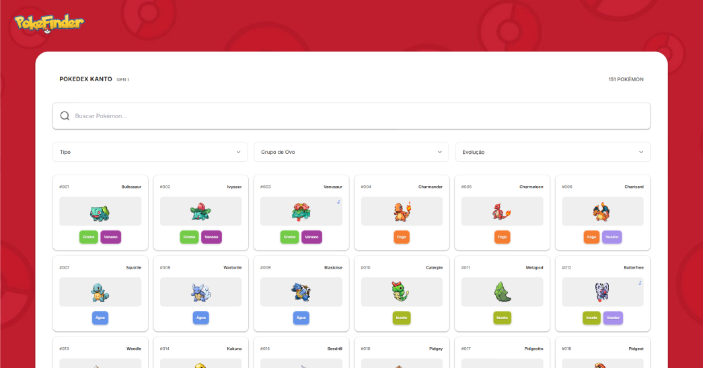

# PokéFinder ❤

Bem-vindo ao PokéFinder!  
Uma aplicação moderna de Pokédex para **Geração I** do Pokémon, permitindo que os usuários explorem e visualizem informações detalhadas sobre os **151 Pokémon** originais dos jogos clássicos.

## 🎮 Sobre o Projeto

O PokéFinder é uma Pokédex interativa e responsiva desenvolvida com Next.js, oferecendo uma experiência visual inspirada nos jogos clássicos de Pokémon, com animações suaves e design moderno.




## ✨ Funcionalidades

### 🔍 Busca e Filtros
- **Busca por nome ou ID:** Encontre Pokémon rapidamente digitando o nome ou número da Pokédex
- **Filtros avançados:**
  - Filtro por **Tipo** (Inseto, Fogo, Água, etc.)
  - Filtro por **Grupo de Ovo**
  - Filtro por **Estágio de Evolução** (Base, 1ª Evolução, 2ª Evolução)

### 📱 Visualização
- **Cards interativos:** Visualize todos os 151 Pokémon em um grid responsivo
- **Sprites animados:** Sprites GIF animados com opção de alternar entre versões masculina e feminina
- **Design responsivo:** Interface adaptada para desktop, tablet e mobile

### 📊 Detalhes Completos
- **Informações básicas:** Peso, altura, grupo de ovo e habilidades
- **Estatísticas base:** Visualização com barras de progresso
- **Cadeia de evolução:** Visualização completa e interativa das evoluções
- **Geração I exclusiva:** Foco nos 151 Pokémon originais
- **Performance otimizada:** Cache de dados e carregamento eficiente

## 🛠️ Tecnologias Utilizadas

- **[Next.js](https://nextjs.org/)** - Framework React para produção
- **[TailwindCSS](https://tailwindcss.com/)** - Framework CSS utilitário
- **[Shadcn/UI](https://ui.shadcn.com/)** - Componentes UI reutilizáveis
- **[GSAP](https://greensock.com/gsap/)** - Biblioteca de animações
- **[Lucide React](https://lucide.dev/)** - Ícones modernos
- **[PokéAPI](https://pokeapi.co/)** - API pública para dados de Pokémon

## 📦 Estrutura do Projeto

```
pokefinder/
├── app/                    # Rotas e páginas Next.js
│   ├── page.tsx           # Página inicial
│   ├── page/              # Página de busca
│   └── [pokemonName]/     # Página de detalhes do Pokémon
├── components/             # Componentes React
│   ├── pokemon-card.tsx   # Card do Pokémon
│   ├── evolution-chain.tsx # Cadeia de evolução
│   └── ui/                # Componentes UI reutilizáveis
├── lib/                    # Utilitários e APIs
│   ├── pokemonAPI.ts      # Funções de API
│   └── translations.ts    # Sistema de traduções
└── public/                 # Arquivos estáticos
```

## 🚀 Como Executar

1. Instale as dependências:
```bash
npm install
```

2. Execute o servidor de desenvolvimento:
```bash
npm run dev
```

3. Abra [http://localhost:3000](http://localhost:3000) no navegador

2025 © Jéssica Rodrigues. Todos os direitos reservados.
